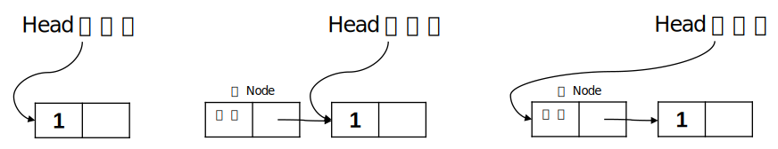
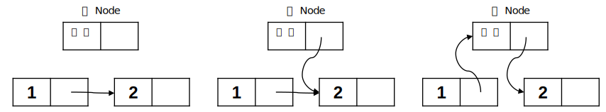

저번 글에서는 Singly Linked List가 무엇인지, Array와 어떻게 다른지를 알아보고 만들어 보았다. 이제는 그 Singly Linked List를 가지고 여러 실험을 해 볼 것이다.

## 실험 1_값 추가하기

값을 추가하는 방법은 크게 3가지가 있다.

1. List의 맨 앞에 추가하기
2. 특정 Node의 앞에 추가하기
3. List의 맨 끝에 추가하기

### 실험 1의 1_List의 맨 앞에 추가하기

먼저 새로운 Node를 맨 앞에 추가해야 하는데, 그러기 위해서는 새 Node를 만들고 그 Node를 head 포인터가 가리키게 만들면 된다. 다음 그림을 보자.



그러기 위해서는 함수의 매개변수로 `head` 포인터의 포인터와 새 `data`를 사용해야 한다. 포인터의 포인터(이중 포인터)를 사용하는 이유는 `head` 포인터는 `int main(void)` 함수에 선언되어 있고, 우리는 `head` 포인터가 가리키는 Node를 바꾸어야 하기 때문이다. 이러한 방법으로 만들어진 코드는 다음과 같다.

```c
void insertFront(struct Node** head, const int data) {
	struct Node* node = (struct Node*)malloc(sizeof(struct Node));

	node -> data = data;
  node -> next = (*head);
  
	(*head) = node;
}
```

### 실험 1의 2_특정 Node의 앞에 추가하기

먼저 새로운 `data`를 새 Node에 저장한다. 그리고 새 Node의 다음 Node를 `prev_node` 의 다음 Node로 한다. 또 `prev_node`의 다음 Node는 새 Node로 한다.


해당 함수의 형태를 생각해보자. 먼저 매개변수로는 우리가 추가할 위치의 바로 전 Node의 포인터와 새로 추가할 값으로 생각할 수 있다. 반환 값은 `void` 이다.

```c
void insert(struct Node* prev_node, const int data) {
	struct Node* node = (sizeof(struct Node))malloc(sizeof(struct Node));
  
	node -> data = data;
	node -> next = prev_node -> next;
  
	prev_node -> next = node;
}
```

### 실험 1의 3_List의 맨 끝에 추가하기

해당 함수의 형태를 생각해보자. 매개변수로는 한 Node의 포인터, 새로 추가될 `data`라고 할 수 있다. 반환 값은 `void`이다.

/*흐름도, 로직 설명 추가 예정*/

```c
void append(struct Node* node, const int data) {
	// insert code here.
}
```

매개변수로 어떤 Node가 들어오든 그 Node가 포함된 List의 마지막 Node를 찾고 앞서 실험 1의 2에서 만들었던 함수를 호출하면 된다.

```c
void append(struct Node** head, const int data) {
  if(*head == NULL) {
    insertFront(head, data);
    return;
  }
  struct Node* last = *head;
  while(last -> next != NULL) {
    last = last -> next;
  }
  struct Node* node = (struct Node*)malloc(sizeof(struct Node));
  node -> data = data;
  node -> next = NULL;

  last -> next = node;
}
```

지금까지 Singly Linked List에 값을 추가하는 여러 방법에 대해 실험해 보았다. 다음에는 값을 삭제하는 방법에 대해 실험해보자.