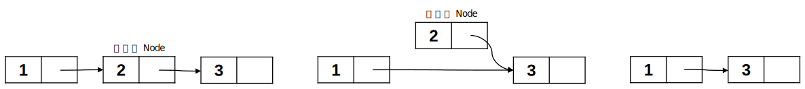

이번에는 Singly Linked List에 있는 값을 삭제하는 실험을 해보자.

## 실험 2_값 삭제하기

먼저 값을 삭제하는 방법은 크게 2가지로 구분된다.

1. 값으로 검색해 처음 나오는  Node삭제
2. 위치(`index`)로 주어진 Node삭제

### 실험 2의 1_검색 삭제

값으로 검색해 삭제하는 방법은 2가지로 구분된다.

1. 중간 Node또는 마지막 Node삭제하기
2. 맨 앞 Node삭제하기

이렇게 2가지로 나누게 된 이유는 만들면서 알게 될 것이며, 이 방법을 서로 다른 함수로 만들지 않고 하나의 함수로 구성할 것이다. 이는 사고 과정일 뿐이다.

#### 중간 Node또는 마지막 Node삭제하기

Node를 삭제하려면 먼저 삭제하려는 Node의 전 Node와 검색할 값이 필요하다. 그 이유는 검색할 값이 저장된 Node를 연결고리에서 끊어내고 그 전 Node의 다음 Node를 끊어낸 Node의 다음 Node로 하면 되기 때문이다.



이를 위해서는 Head 포인터와 검색할 값이 필요하다.

```c
void removeNode(struct Node* head, const int data) {
    struct Node* prev_node = NULL; // 삭제하려는 Node의 전 Node
    // head != NULL: List가 텅 비어있거나 검색할 값이 없는 경우
    while(head != NULL && head -> data != data) {
		prev_node = head;
        head = head -> next;
    }
    prev_node -> next = head -> next;
    free(head);
}
```

#### 맨 앞 Node삭제하기

앞선 예제로 맨 앞 Node를 삭제하려고 하면 세그멘테이션 오류가 발생한다. 허용되지 않은 메모리 영역에 접근했거나 허용되지 않은 접근 방법을 사용했다는 것이다. 따라서 /*작성 중*/

/*temp code*/

```c
void removeNode(struct Node** head, const int data) {
  struct Node* prev_node = NULL;
  struct Node* head_tmp = *head; // 검색용, 맨 앞의 Node를 삭제(free)하기 위함
  while(head_tmp != NULL && head_tmp -> data != data) { // List가 비어 있거나, 마지막 Node를 벗어난 상태(조건)
    prev_node = head_tmp;
    head_tmp = head_tmp -> next;
  }
  if(head_tmp == NULL) return; // if list has no value or key is not in list:
  if(prev_node == NULL) { // delete node at front
    *head = (*head) -> next;
    free(head_tmp);
    return;
  }
  prev_node -> next = head_tmp -> next;
  free(head_tmp);
}
```

### 실험 2의 2_위치 삭제